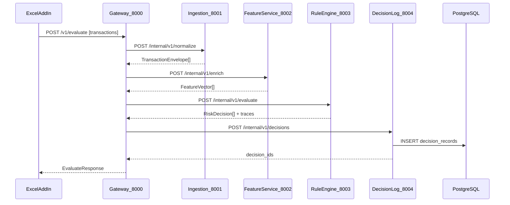
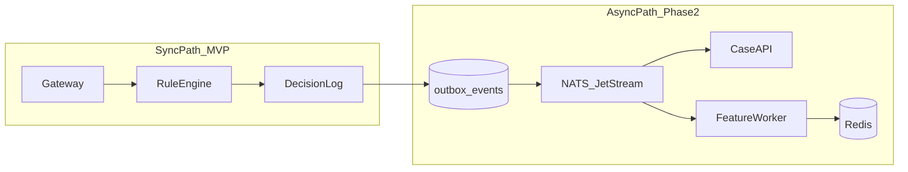

# Fraudy MVP Architecture & Implementation Plan

> **For agentic workers:** REQUIRED SUB-SKILL: Use superpowers:subagent-driven-development (recommended) or superpowers:executing-plans to implement this plan task-by-task. Steps use checkbox (`- [ ]`) syntax for tracking.

**Goal:** Scaffold a greenfield, explainable transaction-fraud platform with a FastAPI microservices backend and an Excel Add-in analyst UI — delivering a working vertical slice (sheet → evaluate → rule hits → replay) before expanding async and case-management features.

**Architecture:** I split Fraudy into six decoupled FastAPI services behind a thin gateway, with a shared Pydantic schema package and versioned YAML rules. Every evaluation produces an immutable `DecisionRecord` with per-rule traces so analysts can replay decisions without re-running black-box logic. MVP stays synchronous (HTTP + Postgres); NATS and Redis plug in behind stable interfaces in Phase 2.

**Tech Stack:** Python 3.12, FastAPI, Pydantic v2, SQLAlchemy 2 + Alembic, PostgreSQL 16, TypeScript 5, Office.js, Webpack, pytest, ruff, mypy. Optional Phase 2: Redis 7, NATS JetStream.

**Domain default:** General payment transaction fraud (amount, merchant, card, geo, velocity). Inspired by Tarka V2 patterns (`evaluator.py`, `domain_boundaries.py`, outbox) but greenfield — no Rust engine, no legacy_attic reuse.

---

## 1. Monorepo Layout

```
/Users/pamu/Documents/Fraudy/
├── README.md                          # Solo-dev overview ("I built...")
├── docker-compose.yml                 # Postgres + all services (MVP)
├── pyproject.toml                     # Root workspace (uv/poetry)
├── Makefile                           # dev, test, gen-types, up/down
│
├── libs/
│   └── fraud-schemas/                 # Shared Pydantic models (Python)
│       ├── pyproject.toml
│       └── src/fraud_schemas/
│           ├── transaction.py         # TransactionEnvelope
│           ├── features.py            # FeatureVector
│           ├── rules.py               # RuleDefinition, RuleHit
│           ├── decision.py            # RiskDecision, DecisionRecord
│           └── openapi.yaml           # Generated from FastAPI (Phase 1b)
│
├── rules/
│   └── v1/
│       ├── ruleset.yaml               # Versioned rule definitions
│       └── README.md                  # Rule authoring guide
│
├── services/
│   ├── gateway/                       # :8000 — public API, auth, routing
│   ├── ingestion/                     # :8001 — validate + normalize events
│   ├── feature-service/               # :8002 — enrichment (velocity MVP)
│   ├── rule-engine/                   # :8003 — explainable evaluation
│   ├── decision-log/                  # :8004 — append-only audit store
│   ├── case-api/                      # :8005 — alert lifecycle (Phase 2)
│   └── config-api/                    # :8006 — rule CRUD + publish (Phase 2)
│
├── add-in/
│   ├── manifest.xml
│   ├── package.json
│   ├── tsconfig.json
│   ├── webpack.config.js
│   └── src/
│       ├── taskpane/
│       │   ├── taskpane.html          # Semantic HTML shell
│       │   ├── taskpane.ts            # Office.onReady bootstrap
│       │   └── taskpane.css
│       ├── excel/
│       │   └── reader.ts              # Excel.run range → Transaction[]
│       ├── api/
│       │   └── client.ts              # Typed HTTP client
│       └── types/
│           └── generated.ts           # From OpenAPI (datamodel-codegen)
│
├── scripts/
│   └── generate-ts-types.sh           # openapi → add-in/src/types/
│
└── docs/
    └── superpowers/
        ├── specs/
        │   └── 2026-06-15-fraudy-design.md
        └── plans/
            └── 2026-06-15-fraudy-mvp-architecture.md  # this file
```

---

## 2. Service Responsibilities

| Service | Port | MVP scope | Phase 2 |
|---------|------|-----------|---------|
| **gateway** | 8000 | `POST /v1/evaluate`, CORS for add-in, correlation IDs | Auth, rate limit |
| **ingestion** | 8001 | Validate `TransactionEnvelope`, idempotency key | Batch ingest |
| **feature-service** | 8002 | In-memory velocity (tx count/amount last 1h per entity) | Redis-backed, geo/device |
| **rule-engine** | 8003 | AST-safe YAML rule eval + trace | Shadow mode |
| **decision-log** | 8004 | Persist + retrieve `DecisionRecord` | Replay API |
| **case-api** | 8005 | — | Alert CRUD, analyst actions |
| **config-api** | 8006 | Load rules from `rules/v1/` | DB-backed publish/rollback |

### Service boundary rules

- **Risk vs business split:** `RiskDecision` carries only fraud fields (`action`, `score`, `evaluation_trace`, `blocking_rule_id`). No P&L or revenue metrics in risk payloads (Tarka `domain_boundaries.py` pattern).
- **Fail-closed audit:** If decision-log persistence fails, gateway returns 503 — never 200 with an unaudited decision.
- **Frozen context:** The `FeatureVector` snapshot is stored inside `DecisionRecord` at evaluation time so replay uses the same inputs.

---

## 3. Architecture Diagrams

### MVP request flow (synchronous)



### Phase 2 async side effects



---

## 4. Explainability Model

Every evaluation returns and persists:

```python
# libs/fraud-schemas/src/fraud_schemas/decision.py (conceptual)
class RuleHit(BaseModel):
    rule_id: str
    rule_version: str
    matched: bool
    action: Literal["ALLOW", "FLAG", "BLOCK"] | None
    reason: str
    inputs: dict[str, Any]          # field values used in condition

class EvaluationTrace(BaseModel):
    ruleset_version: str
    hits: list[RuleHit]
    evaluated_at: datetime

class RiskDecision(BaseModel):
    transaction_id: str
    action: Literal["ALLOW", "FLAG", "BLOCK"]
    score: int                       # sum of matched rule weights
    blocking_rule_id: str | None
    evaluation_trace: EvaluationTrace

class DecisionRecord(BaseModel):
    decision_id: UUID
    transaction: TransactionEnvelope
    features: FeatureVector          # frozen at eval time
    decision: RiskDecision
    created_at: datetime
```

**Replay:** `GET /v1/decisions/{id}/replay` returns the stored `DecisionRecord` — no re-evaluation. Optional `GET /v1/decisions/{id}/re-evaluate` (Phase 2) re-runs current ruleset against frozen features for drift analysis.

**Rule versioning:** `rules/v1/ruleset.yaml` header carries `version: "1.0.0"`. Each `RuleHit` records `rule_version`. Config-api Phase 2 adds effective-date publishing.

---

## 5. Rule Engine Design

I use a **safe AST evaluator** (no `eval()`), adapted from Tarka's Python sidecar pattern:

- Rules defined in YAML: `id`, `version`, `priority`, `condition` (field/operator/value), `action`, `weight`, `reason_template`
- Operators: `eq`, `ne`, `gt`, `gte`, `lt`, `lte`, `in`, `contains`
- Evaluation: sort by priority ascending; evaluate each rule; record hit/miss with inputs; **short-circuit on BLOCK**
- Output: `RiskDecision` + full trace (including non-matching rules for transparency)

Example rule (`rules/v1/ruleset.yaml`):

```yaml
version: "1.0.0"
rules:
  - id: high_amount
    version: "1.0.0"
    priority: 10
    condition:
      field: amount
      operator: gt
      value: 10000
    action: FLAG
    weight: 50
    reason_template: "Amount {amount} exceeds threshold 10000"
  - id: velocity_burst
    version: "1.0.0"
    priority: 20
    condition:
      field: features.tx_count_1h
      operator: gt
      value: 5
    action: BLOCK
    weight: 100
    reason_template: "Entity {entity_id} has {features.tx_count_1h} txs in 1h"
```

---

## 6. Shared Schemas & Type Generation

| Layer | Mechanism |
|-------|-----------|
| Python | `libs/fraud-schemas` installed as editable dep in all services |
| OpenAPI | Gateway exposes `/openapi.json`; aggregation of public DTOs |
| TypeScript | `datamodel-code-generator` or `openapi-typescript` → `add-in/src/types/generated.ts` |
| CI check | `make gen-types && git diff --exit-code` |

**Core types:** `TransactionEnvelope`, `FeatureVector`, `RuleDefinition`, `RuleHit`, `EvaluationTrace`, `RiskDecision`, `DecisionRecord`, `EvaluateRequest`, `EvaluateResponse`.

---

## 7. Excel Add-in MVP

### User flow

1. Analyst selects rows with headers: `transaction_id`, `entity_id`, `amount`, `currency`, `timestamp`, `merchant_id` (optional columns → metadata)
2. Clicks **Analyze** in task pane
3. Add-in reads range via `Excel.run` → builds `TransactionEnvelope[]`
4. `POST /v1/evaluate` to gateway
5. Task pane renders: action badge, score, expandable rule hit list with reasons and inputs
6. Optional: write `action`, `score`, `blocking_rule_id` back to adjacent columns

### Office.js patterns (strict)

- `Office.onReady()` before any Excel API call
- All workbook mutations inside `Excel.run(async (context) => { ... await context.sync(); })`
- Batch reads with `range.load("values")` — no per-cell loops
- Error boundary: catch `Excel.run` failures, show semantic `<output role="alert">`
- Manifest `AppDomains` includes gateway URL

### Task pane structure (semantic HTML)

```html
<main>
  <header><h1>Fraudy Analysis</h1></header>
  <section aria-labelledby="input-heading">
    <h2 id="input-heading">Selection</h2>
    <p id="selection-summary">No range selected</p>
    <button id="analyze-btn" type="button">Analyze selection</button>
  </section>
  <section aria-labelledby="results-heading" aria-live="polite">
    <h2 id="results-heading">Results</h2>
    <ol id="decision-list"></ol>
  </section>
</main>
```

---

## 8. Tech Stack Choices (MVP vs later)

| Component | MVP | Phase 2+ |
|-----------|-----|----------|
| **Database** | PostgreSQL 16 (decisions, rules metadata, cases) | Read replicas |
| **Cache** | In-process dict in feature-service | Redis for velocity windows |
| **Messaging** | None (sync HTTP) | NATS JetStream + transactional outbox |
| **Auth** | None (local dev) | Bearer API key via gateway |
| **Observability** | structlog JSON + `X-Correlation-Id` | OpenTelemetry |
| **Container** | docker-compose | k8s manifests (optional) |

**Why lean MVP:** I can ship the explainability vertical slice in days. Outbox table schema is created in Phase 1 but unused until Phase 2 — avoids rework without operational overhead.

---

## 9. Phased Delivery

### Phase 0 — Scaffold (Day 1)

- Init git repo, root `pyproject.toml`, `docker-compose.yml` (Postgres)
- Create `libs/fraud-schemas` with core Pydantic models
- Create `rules/v1/ruleset.yaml` with 3–5 starter rules
- Stub each service with `/health` endpoint

### Phase 1 — MVP Vertical Slice (Days 2–5)

- **rule-engine:** AST evaluator + tests
- **feature-service:** in-memory velocity enrichment
- **decision-log:** Postgres persistence + GET by id
- **ingestion:** validation + normalization
- **gateway:** orchestrate sync pipeline, `POST /v1/evaluate`
- **add-in:** read sheet → evaluate → display traces
- **scripts:** OpenAPI → TS type generation

**MVP success criteria:**
- [ ] Select 10 rows in Excel → Analyze → see per-row ALLOW/FLAG/BLOCK with rule reasons
- [ ] `GET /v1/decisions/{id}` returns identical trace to live response
- [ ] Rule change in YAML → restart rule-engine → different outcome visible in trace
- [ ] Decision-log failure → gateway returns 503

### Phase 2 — Case Management & Config (Week 2)

- **case-api:** auto-create case on FLAG/BLOCK, status transitions with audit link
- **config-api:** rule CRUD, publish version, effective dates
- Gateway: `GET /v1/cases`, `PUT /v1/cases/{id}/status`
- Add-in: case detail panel, link row → case id write-back

### Phase 3 — Async & Scale (Week 3+)

- Transactional outbox in decision-log
- NATS JetStream consumer for case creation + feature updates
- Redis-backed velocity in feature-service
- Shadow evaluation endpoint: run draft ruleset without persisting

---

## 10. Key Files to Create First (ordered)

| Order | File | Purpose |
|-------|------|---------|
| 1 | `libs/fraud-schemas/src/fraud_schemas/transaction.py` | Canonical input contract |
| 2 | `libs/fraud-schemas/src/fraud_schemas/decision.py` | RiskDecision + DecisionRecord |
| 3 | `rules/v1/ruleset.yaml` | Starter explainable rules |
| 4 | `services/rule-engine/src/rule_engine/evaluator.py` | Core whitebox engine |
| 5 | `services/rule-engine/tests/test_evaluator.py` | TDD rule tests |
| 6 | `services/decision-log/src/decision_log/models.py` | SQLAlchemy DecisionRecord ORM |
| 7 | `services/gateway/src/gateway/routes/evaluate.py` | Orchestration endpoint |
| 8 | `docker-compose.yml` | Postgres + services wiring |
| 9 | `add-in/src/excel/reader.ts` | Sheet → Transaction[] |
| 10 | `add-in/src/taskpane/taskpane.ts` | UI + API integration |

---

## 11. Database Schema (decision-log MVP)

```sql
CREATE TABLE decision_records (
    decision_id       UUID PRIMARY KEY,
    transaction_id    TEXT NOT NULL,
    ruleset_version   TEXT NOT NULL,
    action            TEXT NOT NULL CHECK (action IN ('ALLOW','FLAG','BLOCK')),
    score             INT NOT NULL,
    blocking_rule_id  TEXT,
    payload           JSONB NOT NULL,  -- full DecisionRecord
    correlation_id    TEXT,
    created_at        TIMESTAMPTZ NOT NULL DEFAULT now()
);
CREATE INDEX idx_decision_records_tx ON decision_records (transaction_id);
CREATE INDEX idx_decision_records_created ON decision_records (created_at DESC);

-- Phase 2 outbox (create now, use later)
CREATE TABLE outbox_events (
    id            BIGSERIAL PRIMARY KEY,
    event_type    TEXT NOT NULL,
    payload       JSONB NOT NULL,
    created_at    TIMESTAMPTZ NOT NULL DEFAULT now(),
    published_at  TIMESTAMPTZ
);
```

---

## 12. API Contracts (gateway public surface)

```
POST /v1/evaluate
  Request:  { transactions: TransactionEnvelope[], idempotency_key?: str }
  Response: { decisions: RiskDecision[], decision_ids: UUID[], correlation_id: str }

GET  /v1/decisions/{decision_id}
  Response: DecisionRecord

GET  /v1/decisions/{decision_id}/replay
  Response: DecisionRecord  (same as GET — explicit replay semantics)

GET  /v1/rules
  Response: { ruleset_version: str, rules: RuleDefinition[] }

GET  /health
  Response: { status: "ok" }
```

Phase 2 additions: `/v1/cases/*`, `/v1/rules` POST/PUT, `/v1/evaluate/shadow`.

---

## 13. Tarka Patterns — Reuse vs Skip

| Reuse (concept) | Tarka reference | Fraudy adaptation |
|-----------------|-----------------|-------------------|
| AST-safe rule eval + trace rows | `evaluator.py` | Python-only, YAML rules |
| Risk/business domain split | `domain_boundaries.py` | `fraud-schemas/decision.py` |
| Fail-closed audit | `audit_errors.py` | Gateway 503 on log failure |
| Transaction envelope | `manifest_schema.py` | `TransactionEnvelope` |
| Transactional outbox | `outbox_processor.py` | Phase 2, same pattern |
| JetStream subject taxonomy | `nats_jetstream.py` | Phase 2 |

| Skip | Reason |
|------|--------|
| Rust `tarka-core` engine | Solo dev, Python-first MVP |
| `legacy_attic/`, root `services/` | Archived / over-scoped |
| Shadow agent / LLM reasoning | Black-box; contradicts whitebox goal |
| Dual Python+Rust evaluation | Complexity without MVP value |

---

## 14. Implementation Tasks (Phase 0 + Phase 1)

### Task 1: Repository scaffold

**Files:**
- Create: `README.md`, `pyproject.toml`, `docker-compose.yml`, `Makefile`, `.gitignore`

- [ ] **Step 1:** Init git repo and root Python workspace with `[tool.uv.workspace]` or poetry monorepo members for `libs/fraud-schemas` + each service
- [ ] **Step 2:** Add `docker-compose.yml` with Postgres 16 (`fraudy_pg`, port 5432, volume, healthcheck)
- [ ] **Step 3:** Add `Makefile` targets: `up`, `down`, `test`, `lint`, `gen-types`
- [ ] **Step 4:** Verify `docker compose up -d postgres` starts cleanly

### Task 2: Shared schemas package

**Files:**
- Create: `libs/fraud-schemas/pyproject.toml`
- Create: `libs/fraud-schemas/src/fraud_schemas/{__init__,transaction,features,rules,decision}.py`
- Test: `libs/fraud-schemas/tests/test_schemas.py`

- [ ] **Step 1:** Write failing tests for `TransactionEnvelope` validation (`extra="forbid"`, required fields)
- [ ] **Step 2:** Implement Pydantic models
- [ ] **Step 3:** Write failing tests for `DecisionRecord` round-trip JSON serialization
- [ ] **Step 4:** Implement decision models; run `pytest libs/fraud-schemas -v`

### Task 3: Rule definitions + evaluator

**Files:**
- Create: `rules/v1/ruleset.yaml`
- Create: `services/rule-engine/pyproject.toml`
- Create: `services/rule-engine/src/rule_engine/{main,evaluator,ast_ops,loader}.py`
- Test: `services/rule-engine/tests/test_evaluator.py`

- [ ] **Step 1:** Write failing tests: high amount → FLAG, velocity → BLOCK, short-circuit on BLOCK
- [ ] **Step 2:** Implement YAML loader + AST condition evaluator
- [ ] **Step 3:** Implement trace builder (record inputs per rule)
- [ ] **Step 4:** Run `pytest services/rule-engine -v` — all pass

### Task 4: Feature service (in-memory velocity)

**Files:**
- Create: `services/feature-service/src/feature_service/{main,enricher}.py`
- Test: `services/feature-service/tests/test_enricher.py`

- [ ] **Step 1:** Write failing test: 6 txs same entity within 1h → `tx_count_1h == 6`
- [ ] **Step 2:** Implement sliding-window counter (in-process dict keyed by entity_id)
- [ ] **Step 3:** Expose `POST /internal/v1/enrich`

### Task 5: Decision log service

**Files:**
- Create: `services/decision-log/src/decision_log/{main,models,repository,routes}.py`
- Create: `services/decision-log/alembic/versions/001_initial.py`

- [ ] **Step 1:** Write failing test: persist + retrieve `DecisionRecord` by id
- [ ] **Step 2:** Implement SQLAlchemy model + Alembic migration
- [ ] **Step 3:** Expose `POST /internal/v1/decisions`, `GET /internal/v1/decisions/{id}`

### Task 6: Ingestion service

**Files:**
- Create: `services/ingestion/src/ingestion/{main,normalizer,routes}.py`
- Test: `services/ingestion/tests/test_normalizer.py`

- [ ] **Step 1:** Write failing test: reject missing `entity_id`, normalize timestamp to UTC
- [ ] **Step 2:** Implement normalizer + `POST /internal/v1/normalize`

### Task 7: Gateway orchestration

**Files:**
- Create: `services/gateway/src/gateway/{main,clients,routes/evaluate,deps}.py`
- Test: `services/gateway/tests/test_evaluate.py`

- [ ] **Step 1:** Write failing integration test with httpx mocks for downstream services
- [ ] **Step 2:** Implement evaluate orchestration (ingest → enrich → evaluate → log)
- [ ] **Step 3:** Add fail-closed: if decision-log returns error → 503
- [ ] **Step 4:** Enable CORS for add-in origin; expose `/openapi.json`

### Task 8: Excel Add-in scaffold

**Files:**
- Create: `add-in/manifest.xml`, `add-in/package.json`, `add-in/webpack.config.js`
- Create: `add-in/src/taskpane/{taskpane.html,taskpane.ts,taskpane.css}`
- Create: `add-in/src/excel/reader.ts`, `add-in/src/api/client.ts`

- [ ] **Step 1:** Scaffold Office Add-in (Task Pane, TypeScript)
- [ ] **Step 2:** Implement `reader.ts`: map header row + data rows → `TransactionEnvelope[]`
- [ ] **Step 3:** Implement `client.ts`: typed `evaluate(transactions)` calling gateway
- [ ] **Step 4:** Render results list with rule hit `<details>` elements per transaction
- [ ] **Step 5:** Manual test: sideload in Excel Desktop, analyze sample sheet

### Task 9: Type generation pipeline

**Files:**
- Create: `scripts/generate-ts-types.sh`

- [ ] **Step 1:** Start gateway locally, fetch OpenAPI spec
- [ ] **Step 2:** Generate `add-in/src/types/generated.ts`
- [ ] **Step 3:** Wire `make gen-types` and verify add-in compiles with strict TS

### Task 10: End-to-end verification

- [ ] **Step 1:** `docker compose up` — all services healthy
- [ ] **Step 2:** curl `POST /v1/evaluate` with sample payload → 200 + trace
- [ ] **Step 3:** curl `GET /v1/decisions/{id}` → identical payload
- [ ] **Step 4:** Excel add-in analyze 10-row sheet → results match curl
- [ ] **Step 5:** Stop decision-log → evaluate returns 503

---

## 15. Self-Review Checklist

- [x] All six microservices defined with MVP/Phase 2 scope
- [x] Explainability: traces, replay, versioning covered
- [x] Shared schemas + TS generation path defined
- [x] Excel add-in MVP flow with Office.js patterns
- [x] Tech stack: Postgres MVP, Redis/NATS deferred with interfaces
- [x] Phased delivery with success criteria
- [x] Key files ordered; tasks have file paths
- [x] No placeholders; Tarka reuse explicitly scoped
- [x] Singular voice in architecture descriptions

---

## Execution Handoff

Plan complete and saved to `docs/superpowers/plans/2026-06-15-fraudy-mvp-architecture.md`.

**Two execution options:**

1. **Subagent-Driven (recommended)** — dispatch a fresh subagent per task, review between tasks
2. **Inline Execution** — execute tasks in-session with checkpoints

Which approach?
